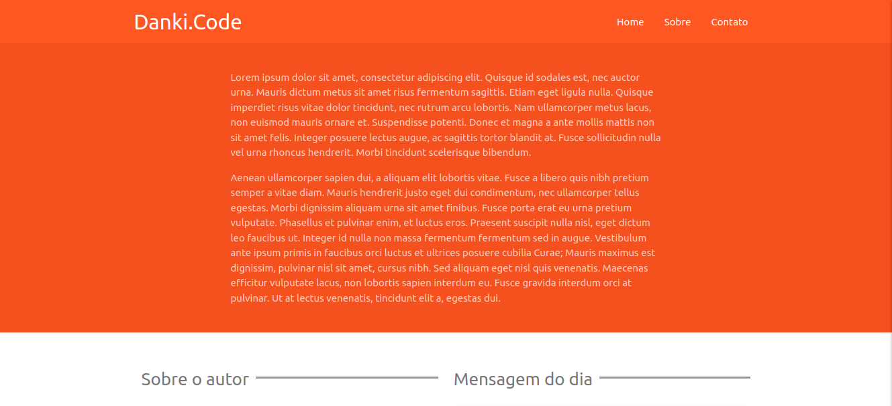
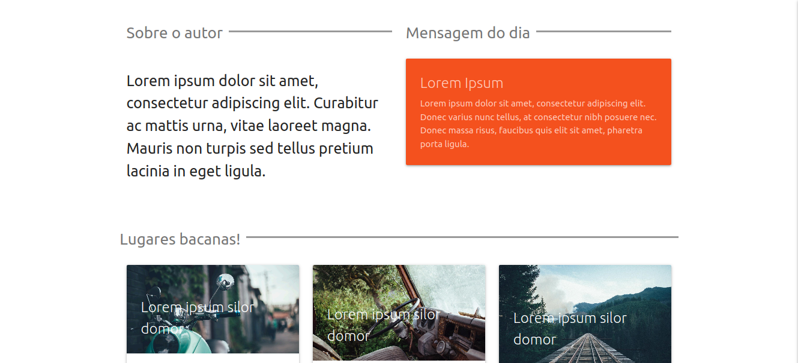
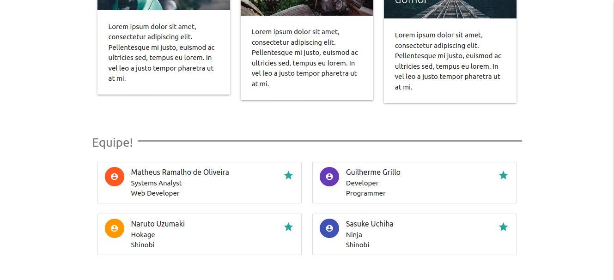
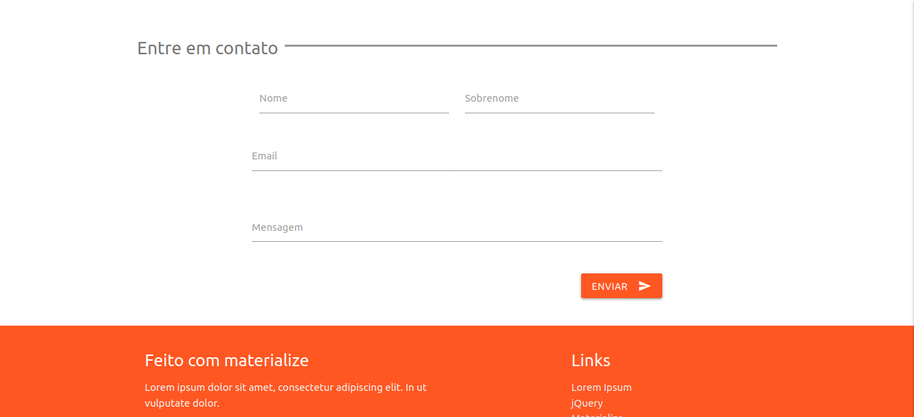
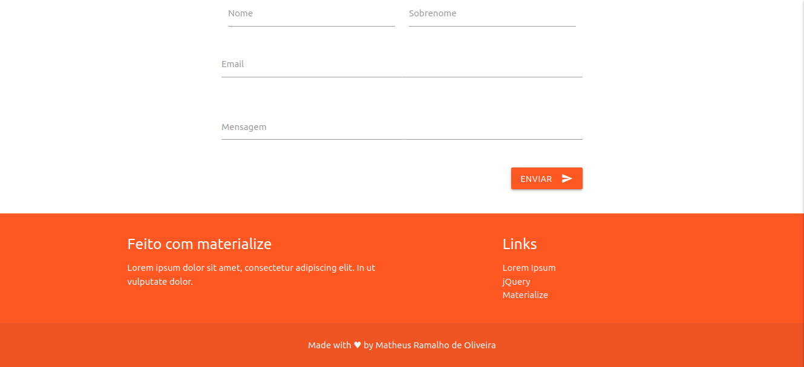

## Danki Code Webmaster Front-End Project 7
> Practical project of the [Danki Code Webmaster Front-End](https://cursos.dankicode.com/curso-front-end-completo) course.

  

  

  

  

  

> 👷 Developed by Matheus Ramalho de Oliveira.  
🔨 Systems Analyst, Full-Stack Developer.  
🏡 Goiânia, Goiás, Brasil.  
✉️ kastorcode@gmail.com  
👍 [instagram.com/kastorcode](https://www.instagram.com/kastorcode)

### 🗓 ️Roadmap
- Basic concepts and configuring work environment.
- Understanding HTML.
- Starting with CSS.
- Dominating CSS.
- Responsive Design and Practical Project #1.
- HTML5 and the news.
- Knowing in practice CSS3.
- Practical projects #2 and #3.
- Practical projects #4 and #5.
- JavaScript and programming logic.
- Introducing jQuery.
- Dominating jQuery.
- Domain and Hosting.
- Final touches.
- Creating E-mail Template with HTML and CSS.
- Creating Layout in Photoshop and Knowing Font Awesome.
- Flexbox Layout and Frameworks.
- Project #6.
- Project #7 (BootStrap).
- Project #8 (Materialize).
- Advanced HTML5 and Advanced CSS3.
- Techniques/Measures for Front-End Development.
- Advanced JavaScript, JS Libraries and Frameworks.
- jQuery Mobile and jQuery UI.
- Project #9.
- Sass/Less.
- NodeJS.
- Project #10.
- Prospecting customers, sales techniques and productivity.
- UX and UI.
